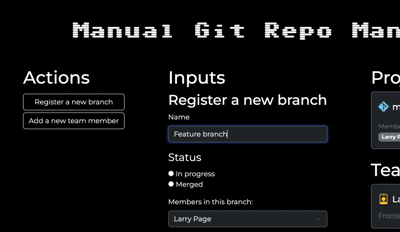

## Manual Git Repo Manager
A manually-updated Git repo and member viewer. 
This is a practice project done as part of the Node JS section of Scrimba's Fullstack course.

## Topics put into practice

|                       |                       |                        |                       |
|-----------------------|-----------------------|------------------------|-----------------------|
| Node        | Async/await          | try/catch       | JSON               |
| Form Handling                  | Client-server communication                  | HTTP Server Routing       | Dynamic rendering        |
| Bootstrap         | ES Modules     | FS modules                | Event Handling        |

